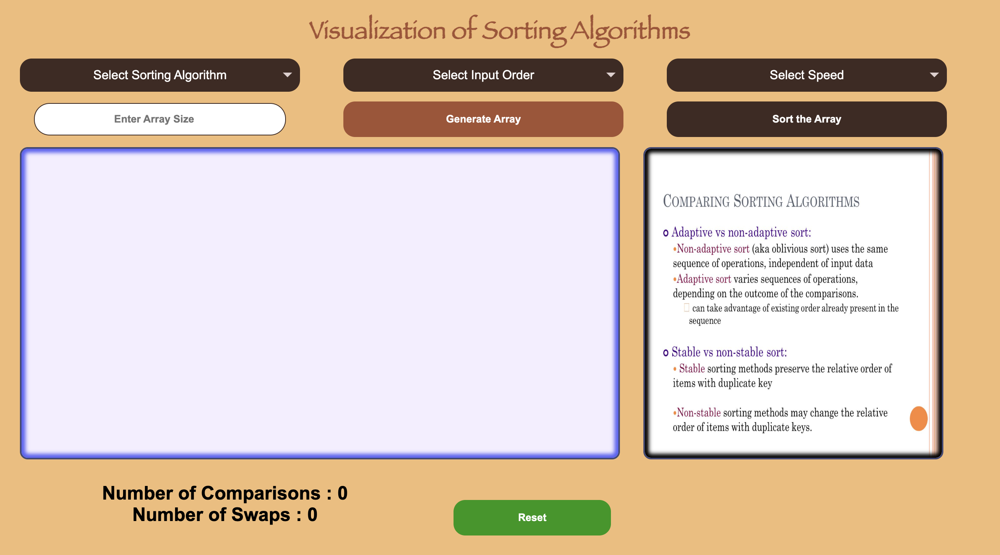
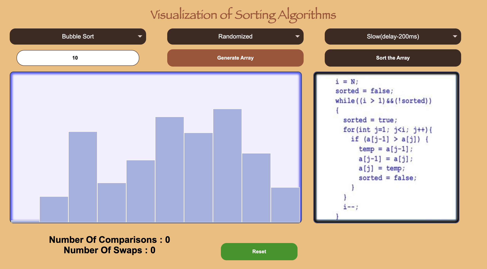
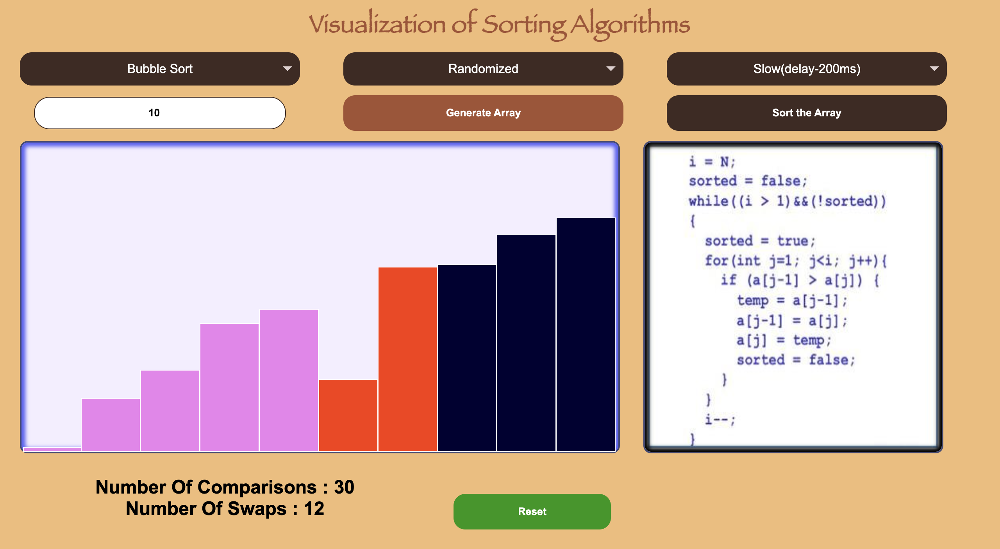
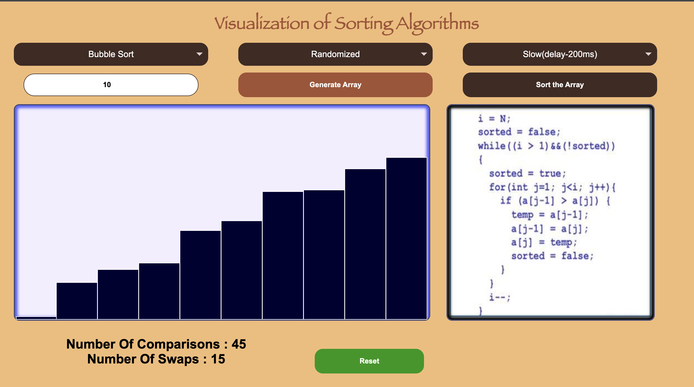

# 📊 Sortlify - Sorting Visualizer

**Sortlify** is a web-based sorting algorithm visualizer that helps you understand and visualize the working of popular sorting algorithms in an interactive and engaging way.

---

## 🚀 Algorithms Included

- 🔁 Bubble Sort  
- 🪝 Insertion Sort  
- ✂️ Selection Sort  
- 🔀 Quick Sort  
- 🧩 Merge Sort

---

## 🎯 Features

- 🎨 Visual representation of sorting algorithms
- 🕹️ Interactive controls to adjust speed and array size
- 🔄 Real-time animation of sorting process
- 🌐 Fully responsive UI

---

## 🛠️ Tech Stack

- **Frontend:** HTML, CSS, JavaScript
- **Visualization:** DOM manipulation & animations

---

## 🏁 Getting Started

```bash
# Clone the project
git clone https://github.com/paveshkanungo/Sortlify.git

# Now, Run the html file in the browser or click on Go Live in VS Code

```

---

## ⎚ Screenshots

> 
> 
> 
> 

---


